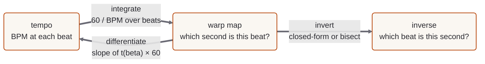

# 01 · The integral

The whole repo lives under one equation. Tempo is the *rate* of beats with respect to
audio time:

$$\frac{d\beta}{dt} = \frac{\text{BPM}}{60}$$

We almost always want the inverse direction — *given a beat, what second is it?* — so
flip the fraction (seconds per beat) and integrate. By the Fundamental Theorem of
Calculus, integrating a rate recovers the total:

$$t(\beta) = \int_{0}^{\beta} \frac{60}{\text{BPM}(b)}\, db$$

The four regimes below are the same integral evaluated for four different shapes of
$\text{BPM}(b)$.

## The whole shape, at a glance

Read the round trip clockwise. **Integrate** the tempo curve to get the warp map;
**differentiate** the warp map to recover the tempo (a DAW's live BPM readout *is*
this derivative); **invert** the warp map to go from an audio second back to a beat
— closed-form where the regime has one, by bisection where it doesn't. Each chapter
formalises one piece of this loop for a different shape of $\text{BPM}(b)$.

<!--@include: ./.generated/one-idea.md-->

## Regime 1 — Constant tempo

$$\text{BPM}(b) = K \implies t(\beta) = \int_0^\beta \frac{60}{K}\, db = \frac{60}{K}\,\beta$$

A line through the origin with slope $60/K$ seconds per beat. The integral of a
constant is the easy rule every calculus course starts with.

<!--@include: ./.generated/regime-constant.md-->

## Regime 2 — Piecewise-constant tempo

This is what beat_this gives you: each beat is a marker, so $\text{BPM}(b)$ is a step
function — flat on each piece, jumping at each marker.

$$t(\beta) = \sum_{\text{completed segments}} \frac{60}{\text{BPM}_i}\,\Delta\beta_i \;\;+\;\; \text{leftover partial segment}$$

The integral is a running sum of rectangle areas — a Riemann sum that happens to be
exact because the integrand is genuinely constant on each piece. The warp map is
piecewise-LINEAR, kinking at every marker where the slope changes.

<RiemannRectangles />

<!--@include: ./.generated/regime-piecewise.md-->

## Regime 3 — Linear ramp (the surprising one)

Let tempo vary *linearly* with beat position between $b_0$ and $b_1$ over $L$ beats,
so $\text{BPM}(b) = b_0 + s\,b$ with $s = (b_1 - b_0)/L$. Then:

$$t(\beta) = \int_0^\beta \frac{60}{b_0 + s\,b}\, db = \frac{60}{s}\,\ln\!\left(\frac{\text{BPM}(\beta)}{b_0}\right)$$

A *linear* change in tempo produces a *logarithmic* time map. The curve bends — and
if you naively interpolate beat positions in a straight line you will drift against
the audio. The code derives exactly why, naming the calculus rule
$\int 1/(p+qx)\,dx = (1/q)\ln|p+qx|$ as it is used.

<LogarithmicBend />

<!--@include: ./.generated/regime-ramp.md-->

## Regime 4 — Curved tempo (the one without a formula)

Let tempo follow a *power curve* with an easing exponent $k > 0$:

$$\text{BPM}(b) = b_0 + (b_1 - b_0)\cdot(b/L)^k$$

For general $k$ the integrand $60/(b_0 + \Delta(b/L)^k)$ has **no elementary
antiderivative**. There is simply no combination of polynomials, exponentials,
logarithms, and trig that evaluates this integral for arbitrary $k$. So you stop
trying to solve symbolically and **evaluate it numerically**:

- **Trapezoidal rule** for the forward direction `beatsToSeconds`. Slice $[0,\beta]$
  into $n$ pieces of width $h = \beta/n$, approximate the area on each slice with a
  trapezoid, sum.
- **Bisection** for the inverse `secondsToBeats`. Binary-search for the $\beta$ that
  makes `beatsToSeconds(β) = t`. This is safe *because* the warp map is strictly
  monotone, so exactly one root exists.

This regime is the reason every real DAW integrates tempo numerically rather than
reaching for a formula: once tempo automation can be an arbitrary curve, a formula
usually doesn't exist.

<TrapezoidSlices />

<!--@include: ./.generated/regime-curved.md-->

## The round trip — BPM is the derivative

The piece that closes the calculus loop: a live BPM readout is the *derivative* of
the warp map coming back around.

$$\text{BPM}(\beta) = 60 \cdot \frac{d\beta}{dt} = \frac{60}{dt/d\beta}$$

Each map's `bpmAt(β)` IS that derivative, evaluated analytically where a formula
exists. The test suite estimates $dt/d\beta$ numerically from `beatsToSeconds` at
small $h$ and confirms $60\,h/(t(\beta+h)-t(\beta))$ matches `bpmAt(β)` across all
four regimes.

<!--@include: ./.generated/round-trip.md-->
